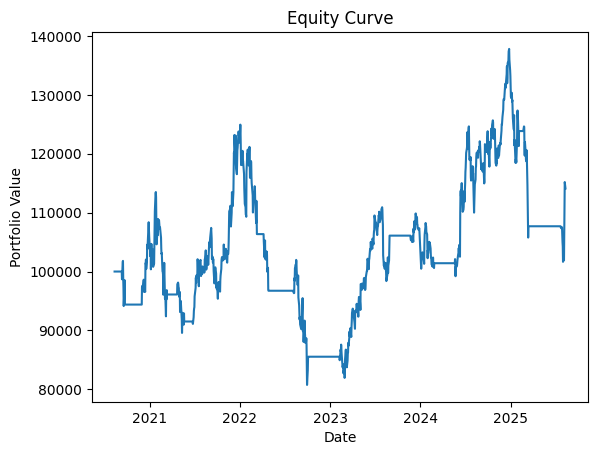

# TradeSage 📈

A powerful and flexible trading strategy backtesting framework built in Python. TradeSage allows you to test trading strategies on historical data, analyze performance metrics, and visualize results.

## 🎯 Why I Built This

As someone passionate about algorithmic trading and quantitative finance, I wanted to create a comprehensive backtesting framework that demonstrates both the technical implementation of trading strategies and the analytical rigor required to evaluate their performance. This project showcases my ability to build production-ready financial software with proper risk management, performance metrics, and data visualization capabilities. It's designed to be both educational for learning trading concepts and practical for strategy development and testing.

## 🚀 Key Features

- **Modular Design with Strategy Plug-ins**: Clean, extensible architecture allowing easy addition of new trading strategies
- **SMA Crossover Strategy with Buy/Sell Signals**: Implements Simple Moving Average crossover logic with clear entry/exit signals
- **Custom Backtest Loop with Vectorized Returns**: Efficient, vectorized backtesting engine for fast strategy evaluation
- **Advanced Performance Metrics**: Comprehensive risk and return analysis including Sharpe ratio, maximum drawdown, and trade statistics
- **Visualized Cumulative Returns**: Interactive charts comparing strategy performance vs market benchmarks
- **Flexible Data Input**: Support for multiple data formats and sources (CSV, API integrations)
- **Command-Line Interface**: Professional CLI for batch testing and automation
- **Jupyter Notebook Integration**: Interactive analysis and strategy development environment

## 📁 Project Structure

```
TradeSage/
├── data/                    # Historical price data
│   └── AAPL_5y.csv         # Apple stock data (5 years)
├── notebooks/               # Jupyter notebooks for analysis
│   └── trade_analysis.ipynb # Interactive analysis notebook
├── plots/                   # Generated performance plots
│   └── backtest_result.png  # Equity curve visualization
├── tradesage/               # Main package
│   ├── __init__.py         # Package initialization
│   ├── main.py             # CLI entry point
│   ├── strategy.py         # Trading strategy implementation
│   ├── backtester.py       # Backtesting engine
│   ├── metrics.py          # Performance calculation functions
│   └── utils.py            # Utility functions (data loading, plotting)
├── requirements.txt         # Python dependencies
└── README.md               # This file
```

## 🛠️ Installation

### Prerequisites

- Python 3.8 or higher
- pip (Python package installer)

### Setup

1. **Clone or download the project**:
   ```bash
   git clone <repository-url>
   cd TradeSage
   ```

2. **Install required packages**:
   ```bash
   pip install -r requirements.txt
   ```

### Dependencies

The following packages are automatically installed:

- **pandas**: Data manipulation and analysis
- **numpy**: Numerical computing
- **matplotlib**: Data visualization
- **yfinance**: Yahoo Finance data downloader

## 📊 How It Works

### Trading Strategy: SMA Crossover

The Simple Moving Average (SMA) Crossover strategy is a popular trend-following approach:

1. **Calculate two moving averages**:
   - Short-term MA (e.g., 20-day)
   - Long-term MA (e.g., 100-day)

2. **Generate signals**:
   - **BUY**: When short-term MA crosses above long-term MA
   - **SELL**: When short-term MA crosses below long-term MA

3. **Execute trades**:
   - Buy/sell the asset based on signals
   - Track portfolio value over time

### Backtesting Process

1. **Load historical data** from CSV files
2. **Calculate moving averages** for the specified periods
3. **Generate trading signals** based on MA crossovers
4. **Simulate trades** with the specified initial capital
5. **Calculate performance metrics**:
   - Cumulative return
   - Sharpe ratio (risk-adjusted return)
   - Maximum drawdown
   - Total number of trades
6. **Generate visualization** of the equity curve

## 🎯 Usage

### Basic Backtest

Run a backtest with default parameters:

```bash
python -m tradesage.main --data-file data/AAPL_5y.csv --short-ma 50 --long-ma 200 --initial-capital 100000 --output-plot plots/backtest_result.png
```

### Command Line Options

| Parameter | Description | Default | Example |
|-----------|-------------|---------|---------|
| `--data-file` | Path to CSV file with price data | Required | `data/AAPL_5y.csv` |
| `--short-ma` | Short moving average period | 50 | `20` |
| `--long-ma` | Long moving average period | 200 | `100` |
| `--initial-capital` | Starting portfolio value | 100000 | `50000` |
| `--output-plot` | Path to save equity curve plot | `plots/backtest_result.png` | `my_results.png` |

### Example Commands

**Conservative Strategy** (longer periods):
```bash
python -m tradesage.main --data-file data/AAPL_5y.csv --short-ma 100 --long-ma 300 --initial-capital 100000
```

**Aggressive Strategy** (shorter periods):
```bash
python -m tradesage.main --data-file data/AAPL_5y.csv --short-ma 10 --long-ma 50 --initial-capital 100000
```

**Custom Output Location**:
```bash
python -m tradesage.main --data-file data/AAPL_5y.csv --output-plot results/my_analysis.png
```

## 📈 Understanding Results

### Performance Metrics

1. **Cumulative Return**: Total percentage return over the backtest period
   - Positive: Strategy made money
   - Negative: Strategy lost money

2. **Sharpe Ratio**: Risk-adjusted return measure
   - Higher is better (typically > 1.0 is good)
   - Measures return per unit of risk

3. **Maximum Drawdown**: Largest peak-to-trough decline
   - Lower is better (e.g., -20% means worst decline was 20%)
   - Important for risk management

4. **Total Trades**: Number of buy/sell signals executed
   - More trades = more active strategy
   - Consider transaction costs for high-frequency trading

### Sample Output

```
Backtest Results:
  Cumulative Return: 0.1411
  Sharpe Ratio: 0.2333
  Max Drawdown: -0.3538
  Total Trades: 21.0000
Equity curve saved to plots/backtest_result.png
```

### 📊 Sample Output Visualization



*Equity curve showing portfolio value over time with buy/sell signals marked*

## 📊 Data Format

### Required CSV Structure

Your CSV file should have the following columns:
- **Date**: Date in YYYY-MM-DD format
- **Close**: Closing price for each day
- **High**: Highest price of the day (optional)
- **Low**: Lowest price of the day (optional)
- **Open**: Opening price of the day (optional)
- **Volume**: Trading volume (optional)

### Example CSV Format

```csv
Price,Close,High,Low,Open,Volume
Ticker,AAPL,AAPL,AAPL,AAPL,AAPL
Date,,,,,
2020-08-12,110.05,110.31,107.41,107.60,165598000
2020-08-13,112.00,113.00,110.95,111.43,210082000
...
```

### Getting Data

You can download stock data using yfinance:

```python
import yfinance as yf

# Download Apple data
aapl = yf.download('AAPL', start='2020-01-01', end='2024-01-01')
aapl.to_csv('data/AAPL_4y.csv')

# Download Tesla data
tsla = yf.download('TSLA', start='2020-01-01', end='2024-01-01')
tsla.to_csv('data/TSLA_4y.csv')
```

## 🔧 Customization

### Modifying the Strategy

Edit `tradesage/strategy.py` to implement different trading strategies:

```python
class MyCustomStrategy:
    def __init__(self, param1, param2):
        self.param1 = param1
        self.param2 = param2
    
    def generate_signals(self, data):
        # Your custom logic here
        signals = pd.DataFrame(index=data.index)
        signals['signal'] = 0  # 1 for buy, -1 for sell, 0 for hold
        return signals
```

### Adding New Metrics

Extend `tradesage/metrics.py` to calculate additional performance measures:

```python
def calculate_sortino_ratio(returns, risk_free_rate=0.0):
    """Calculate Sortino ratio (downside risk-adjusted return)"""
    excess_returns = returns - risk_free_rate
    downside_returns = excess_returns[excess_returns < 0]
    downside_std = downside_returns.std()
    return excess_returns.mean() / downside_std if downside_std != 0 else 0
```

## 📚 Jupyter Notebook Analysis

Open `notebooks/trade_analysis.ipynb` for interactive analysis:

- Explore data structure and quality
- Test different parameter combinations
- Create custom visualizations
- Perform statistical analysis

## 🚨 Important Notes

### Risk Disclaimer

⚠️ **This is for educational and research purposes only.**
- Past performance does not guarantee future results
- Always do your own research before making investment decisions
- Consider transaction costs, taxes, and market conditions
- This is not financial advice

### Limitations

- **No transaction costs**: Real trading incurs fees and slippage
- **Perfect execution**: Assumes trades execute at exact prices
- **No market impact**: Large orders can affect prices
- **Historical data**: Future market conditions may differ

## 🤝 Contributing

Feel free to contribute to this project:

1. Fork the repository
2. Create a feature branch
3. Make your changes
4. Add tests if applicable
5. Submit a pull request

## 📄 License

This project is open source and available under the [MIT License](LICENSE).

## 🆘 Troubleshooting

### Common Issues

**"Missing column provided to 'parse_dates': 'Date'"**
- Check your CSV file format
- Ensure the Date column exists and is named correctly

**"KeyError: 'Close'"**
- Verify your CSV has a Close column
- Check the data loading function in `utils.py`

**"No module named 'tradesage'"**
- Make sure you're in the project root directory
- Install dependencies: `pip install -r requirements.txt`

### Getting Help

If you encounter issues:
1. Check the error message carefully
2. Verify your data format
3. Ensure all dependencies are installed
4. Open an issue with details about the problem

## 🎯 Next Steps & Future Enhancements

### Immediate Improvements
1. **Add support for multiple tickers** - Portfolio backtesting across multiple assets
2. **Implement position sizing** - Kelly criterion, risk parity, and volatility targeting
3. **Add stop-loss and take-profit** mechanisms for better risk management
4. **Include transaction costs** - Realistic trading fees and slippage modeling

### Advanced Features
1. **Integrate with Alpaca or Interactive Brokers API** - Live trading capabilities
2. **Expand strategy library** - RSI, MACD, Bollinger Bands, Mean Reversion, etc.
3. **Machine Learning integration** - LSTM, Random Forest, and ensemble methods
4. **Real-time data feeds** - WebSocket connections for live market data
5. **Backtesting optimization** - Genetic algorithms for parameter tuning

### Production Features
1. **Web dashboard** - Interactive web interface for strategy management
2. **Database integration** - PostgreSQL for storing historical data and results
3. **Cloud deployment** - AWS/GCP deployment for scalable backtesting
4. **API endpoints** - RESTful API for external integrations
5. **Performance monitoring** - Real-time strategy performance tracking

---

**Happy Trading! 📈💰**
